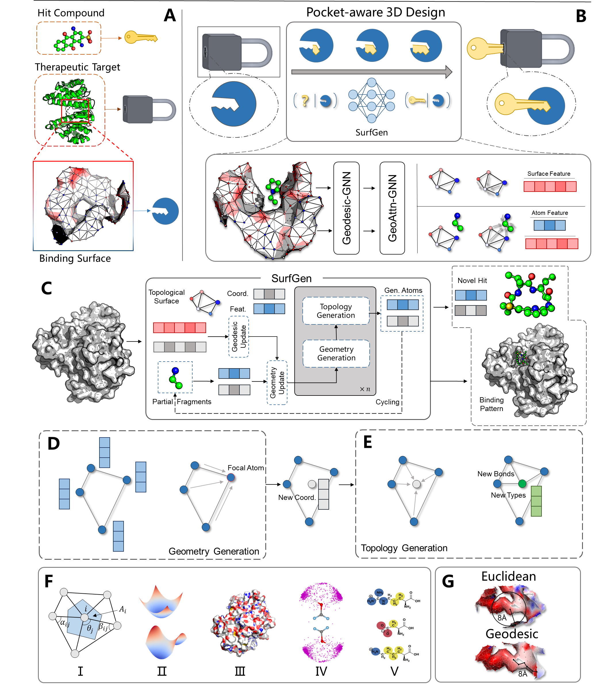
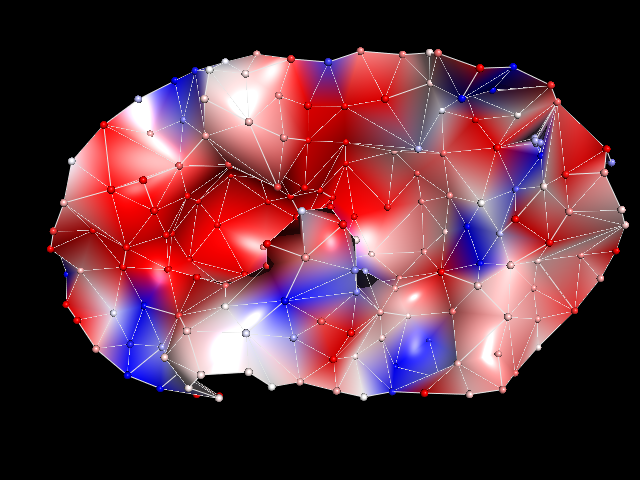
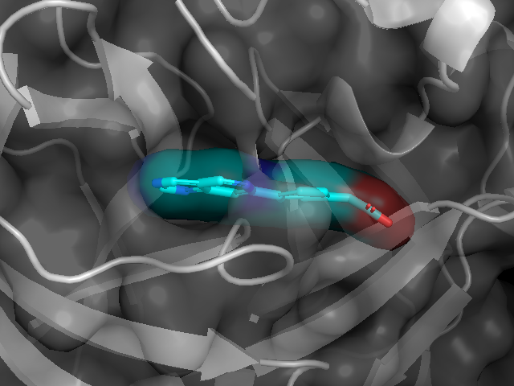
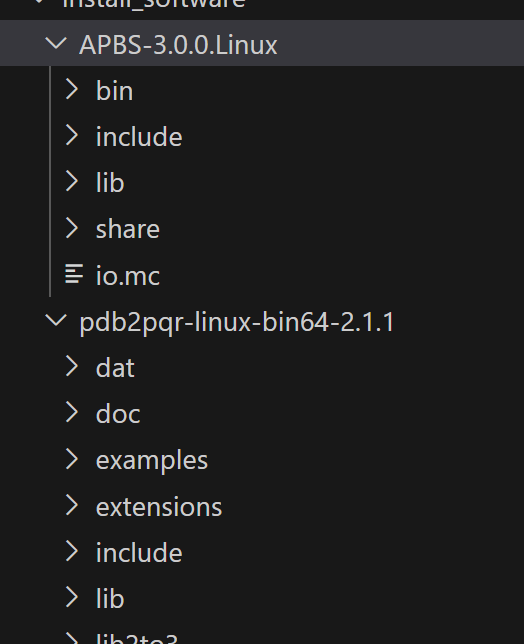
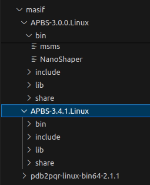

# :loudspeaker: SurfGen: Learning on Topological Surface and Geometric Structure for 3D Molecular Generation

<div align=center>

</div>


<center> The illustration of the generation process </center>

## Environment

### CUDA11.3: Install via conda .yml file

```python
conda install mamba
mamba env create -f surfgen_env.yml -n surfgen
conda activate surfgen 
```

If you're reluctant to use mamba: 

```python
conda env create -f surfgen_env.yml -n surfgen
```

### CUDA11.3: Install via conda-pack file 

We also provide conda-packed file [here](https://doi.org/10.5281/zenodo.7758282). Download it and then unzip it in your conda/envs/dir. For me, the directory is ~/.conda/envs. Special thanks to the creators and organizers of zenodo, which provides a free platform to store large files for academic use. 

```shell
mkdir ~/.conda/envs/surfgen
tar -xzvf surfgen.tar.gz -C ~/.conda/envs/surfgen
conda activate surfgen
```

### CUDA 12.1: Install manually

Since Nvidia 40 series cards no longer support CUDA 11.3, I also created the SurfGen environment for an RTX-4080-powered linux system. 

```shell
mamba create -n surfgen pytorch==2.2.2 torchvision==0.17.2 torchaudio==2.2.2 pytorch-cuda=12.1 plyfile pyg rdkit biopython easydict jupyter ipykernel lmdb -c pytorch -c nvidia -c pyg -c conda-forge
pip install lmdb
pip install pyg_lib torch_scatter torch_sparse torch_cluster torch_spline_conv -f https://data.pyg.org/whl/torch-2.2.0+cu121.html
```

Note: PyG subgraph function has been put to another place, therefore, replace the following command at ./utils/transform.py

```python
# from torch_geometric.utils.subgraph import subgraph
from torch_geometric.data.data import subgraph
```

## Data

The main data used for training is CrossDock2020 

#### Download the data from the original source

```python
wget https://bits.csb.pitt.edu/files/crossdock2020/CrossDocked2020_v1.1.tgz -P data/crossdock2020/
tar -C data/crossdock2020/ -xzf data/crossdock2020/CrossDocked2020_v1.1.tgz
wget https://bits.csb.pitt.edu/files/it2_tt_0_lowrmsd_mols_train0_fixed.types -P data/crossdock2020/
wget https://bits.csb.pitt.edu/files/it2_tt_0_lowrmsd_mols_test0_fixed.types -P data/crossdock2020/
```

Then follow the guidelines to process it.  The train data split is [split_name.pt](https://drive.google.com/file/d/1WUZVNv--gztqDNoA3BEexXdjRfXKHuHn/view?usp=share_link). 

If it's inconvenient for you, we also provided the [processed data](https://doi.org/10.5281/zenodo.8421729). You just need to download them in ./data  and create a ./data/crossdock_pocket10 directory, and put the [index.pkl](https://drive.google.com/file/d/1-YCXOV-MWDOE-p6laQxOKPLPVJRakpL1/view?usp=share_link) in it.


### (Optional) Making surface data on your own. 

#### Create the base Python environment

##### Approach 1

Although we have prepared the required data for training and evaluation above. But you may want to apply SurfGen in your own case. So we provide the guidelines for creating the surf_maker environment.

```python
conda create -n surf_maker pymesh2 jupyter scipy joblib biopython rdkit plyfile -c conda-forge
```

We highly recommend using mamba instead of conda for speeding up. 

```python
mamba create -n surf_maker pymesh2 jupyter scipy joblib biopython rdkit plyfile -c conda-forge
```

##### Approach 2

We also provide the .yml file for creating environment

```
conda env create -f surf_maker_environment.yml
```

#### Install APBS Toolkits

When the base python environment was created, then install [APBS-3.0.0](https://github.com/Electrostatics/apbs/releases), [pdb2pqr-2.1.1](https://github.com/Electrostatics/apbs-pdb2pqr/releases) on your computer. Then set the msms_bin, apbs_bin, pdb2pqr_bin, and multivalue_bin path directly in your ~/.bashrc, or just set them in the scripts when creating the surface file from the pdb file.  

#### Try Generate Surface Now !

Having successfully set up all the necessary environments, you can now proceed to generate surface data. Please follow the instructions in `./data/surf_maker` for this process. Alternatively, to test the successful configuration of your environment, you can execute the `./data/surf_maker/surf_maker_test.py` script.

```shell
from generate_prot_ply import compute_inp_surface
# or from utils.generate_prot_ply import compute_inp_surface
prot_path = './PLD-1/8k5n_protein.pdb'
lig_path = './PLD-1/8k5n_ligand.sdf'
compute_inp_surface(prot_path, lig_path)
# It will take about 10s to compute a ply file in a single run. 
```

If you face the error: "**error while loading shared libraries: libTABIPBlib.so: cannot open shared object file: No such file or directory**". please add the following line to your ~/.bashrc file or directly add it to the os.environ. Then set the msms_bin, apbs_bin, pdb2pqr_bin, multivalue_bin to the correct path in your system 

```python
import os
# change the path for your own path
os.environ["LD_LIBRARY_PATH"] = '/home/haotian/Molecule_Generation/SurfBP/dataset/install_software/APBS-3.0.0.Linux/lib'
msms_bin="/home/haotian/Molecule_Generation/SurfBP/dataset/install_software/APBS-3.0.0.Linux/bin/msms"
apbs_bin = '/home/haotian/Molecule_Generation/SurfBP/dataset/install_software/APBS-3.0.0.Linux/bin/apbs'
pdb2pqr_bin="/home/haotian/Molecule_Generation/SurfBP/dataset/install_software/pdb2pqr-linux-bin64-2.1.1/pdb2pqr"
multivalue_bin="/home/haotian/Molecule_Generation/SurfBP/dataset/install_software/APBS-3.0.0.Linux/share/apbs/tools/bin/multivalue"
```

We provide the generated surface file at ./data, namely 3cl_pocket_8.0_res_1.5.ply for further generation. 

<div align=center>

</div>


## Generation 

To generate the example, run the gen.py. The model's parameters can be downloaded [here](https://drive.google.com/file/d/1SHSzwK_DOh1ClWFP7jCgMNE43b1MWV2e/view?usp=share_link). Put it at ./ckpt. 

We provide an example of the pharmaceutic target for Covid-19, 3cl protein, in the ./example, run the following code to generate inhibitors directly inside the pocket! 

```python
python gen.py --outdir example --check_point ./ckpt/val_119.pt --ply_file ./example/3cl_pocket_8.0_res_1.5.ply
```

<div align=center>

</div>


## Training 

```python
python train.py
```


## Cite

If you find this work interesting, please cite:

```
@article{zhang2023learning,
  title={Learning on topological surface and geometric structure for 3D molecular generation},
  author={Zhang, Odin and Wang, Tianyue and Weng, Gaoqi and Jiang, Dejun and Wang, Ning and Wang, Xiaorui and Zhao, Huifeng and Wu, Jialu and Wang, Ercheng and Chen, Guangyong and others},
  journal={Nature Computational Science},
  volume={3},
  number={10},
  pages={849--859},
  year={2023},
  publisher={Nature Publishing Group US New York}
}
```


## Note

For surface generation, a common error is:

```shen
No such file or directory: '/tmp/tmpc5aa wvj/temp1_out.csv'
```

This error primarily originates from APBS tools. Breaking down the code reveals the exact problem:

```shell
error while loading shared libraries: libTABIPBlib.so: cannot open shared object file: No such file or directory
```

This occurs because the APBS library is not included in the `LD_LIBRARY_PATH`

### How to fix

For **Ubuntu 18 system**, once you download [APBS-3.0.0](https://github.com/Electrostatics/apbs/releases) (~300MB) and [pdb2pqr-2.1.1](https://github.com/Electrostatics/apbs-pdb2pqr/releases) on your computer, like:

<div align=center>

</div>

Then, add the `LD_LIBRARY_PATH` to your `~/.bashrc`, for example:

```shell
# Install Vim if necessary:
sudo apt install vim

# Edit ~/.bashrc
vim ~/.bashrc

# Append the following command at the end of the ~/.bashrc:
...
export LD_LIBRARY_PATH="/home/haotian/software/miniconda3/envs/deepdock/lib:$LD_LIBRARY_PATH"
...
# Save and exit Vim, then activate the setting:

source ~/.bashrc # active the setting
```

However, sometimes another error might occur:

```shell
libreadline.so.7: cannot open shared object file: No such file or directory
```

When I encountered this problem, I was using  **Ubuntu 22**. I found that `libreadline.so.7` is only available for **Ubuntu 18**, and there is no easy way to install `libreadline.so.7` on Ubuntu 22 system. Eventually, I found a solution by downloading both `APBS-3.0.0` and `APBS-3.4.1`. I stored these two software in [Zenodo](https://doi.org/10.5281/zenodo.11179235). 

<div align=center>

</div>

Assign the paths at `./utils/masif/generate_prot_ply.py` as follows:

```python
msms_bin="{install_path}/APBS-3.0.0.Linux/bin/msms"
apbs_bin = '{install_path}/APBS-3.4.1.Linux/bin/apbs'
pdb2pqr_bin="{install_path}/pdb2pqr-linux-bin64-2.1.1/pdb2pqr"
multivalue_bin="{install_path}/APBS-3.0.0.Linux/share/apbs/tools/bin/multivalue"
```

